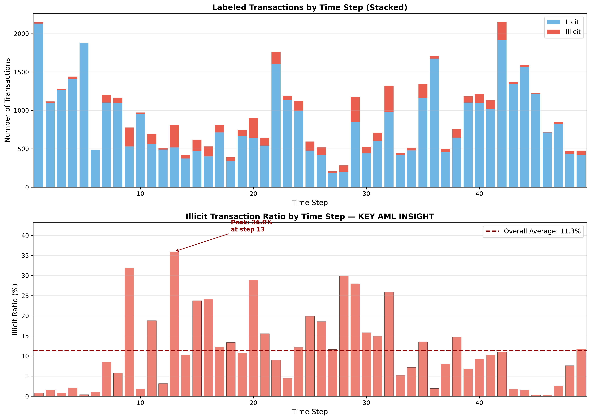
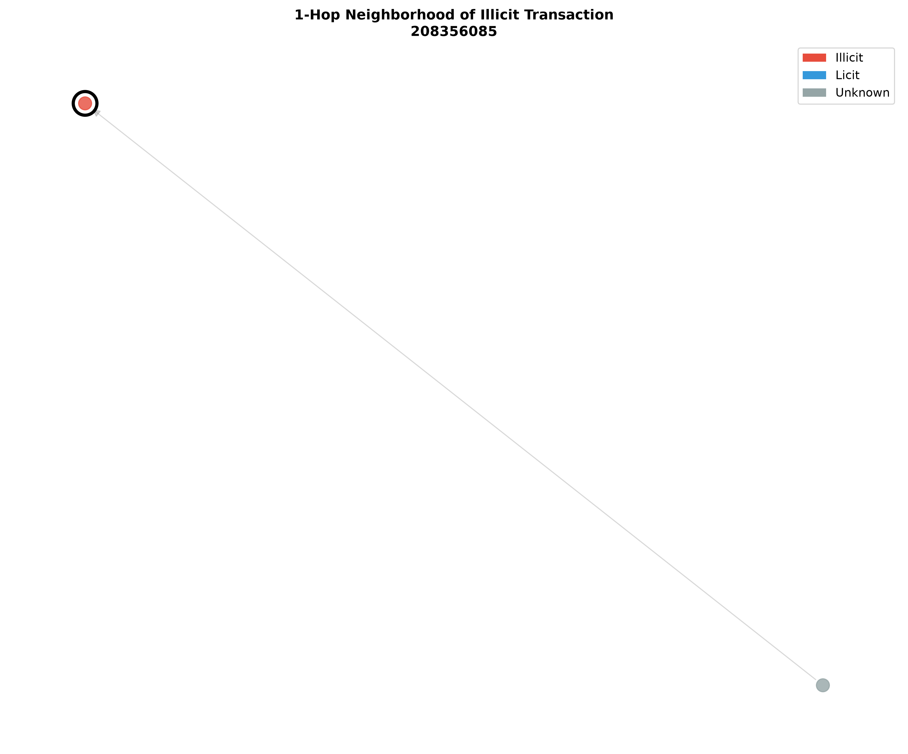
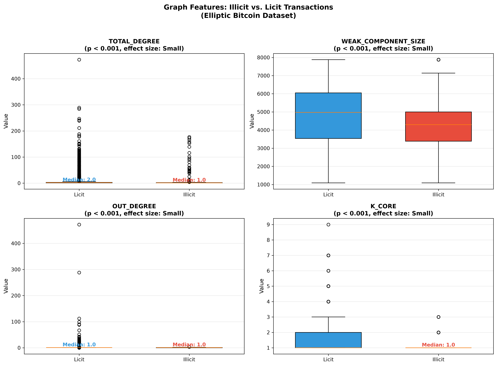
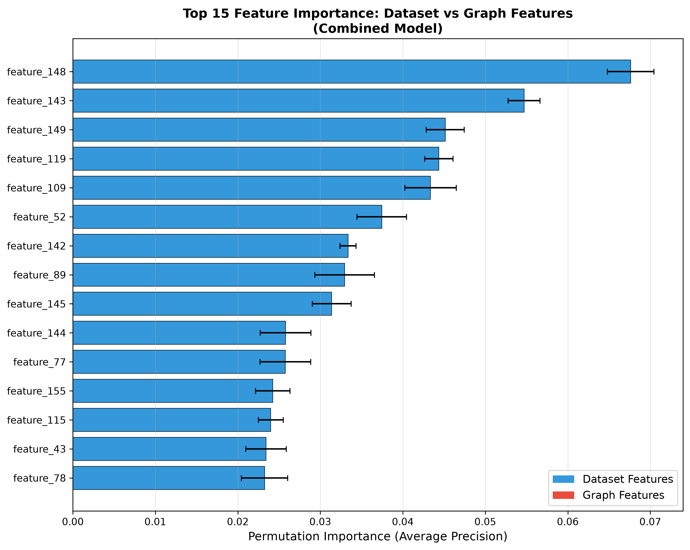

# Graph-Based Financial Crime Detection

**Research-grade AML pipeline modeling 203,769 Bitcoin transactions as a directed graph. Engineered 7 interpretable network-risk features, statistically tested their discriminative power, and compared graph-enhanced ML against dataset-provided baselines using strict temporal splits. Built for VARA-licensed VASP compliance roles in the UAE.**

| Metric | Value |
|:---|:---|
| Best PR-AUC | 0.6384 (XGBoost, Dataset Only) |
| Best F1-Score | 0.5303 (XGBoost, Dataset Only) |
| Precision improvement with graph | +5.7% |
| False alerts reduced at 80% recall | 105 fewer |
| Statistical validation | Bootstrap 95% CIs, McNemar's exact test |
| Tests passing | 6/6 pytest |

---

## Research Question

Do graph-theoretic features (PageRank, degree, clustering, k-core, centrality) improve suspicious transaction detection compared to dataset-provided features alone?

**Answer:** Graph features alone are catastrophic (PR-AUC < 0.08). Combined with dataset features, they do not improve PR-AUC but provide interpretable structural risk indicators and modest precision gains (+5.7%) for compliance workflows.

---

## At a Glance

| | |
|:---|:---|
| **Dataset** | Elliptic Bitcoin — 203,769 nodes, 234,355 edges |
| **Labels** | 46,564 labeled (4,545 illicit, 42,019 licit) |
| **Graph features** | 7 (PageRank, degree, clustering, k-core, component size) |
| **Models** | Logistic Regression, Random Forest, XGBoost |
| **Primary metric** | PR-AUC (not accuracy) |
| **Split** | Temporal: train t <= 30, test t > 40 |
| **Tests** | 6/6 pytest passing |
| **Target** | VARA-licensed VASP compliance, UAE |

---

## Key Design Decisions

| Decision | Choice | Why It Matters |
|:---|:---|:---|
| Graph type | Directed (DiGraph) | Bitcoin transactions have flow direction |
| Unknown nodes | Kept in graph | Breaking topology corrupts centrality scores |
| Train/test split | Temporal (t<=30 vs t>40) | Simulates real AML; most papers cheat with random split |
| Primary metric | PR-AUC | Accuracy is misleading with 9.8% illicit rate |
| Statistical rigor | Mann-Whitney U + effect sizes + Bootstrap CIs + McNemar's | Separates this from 90% of Kaggle portfolios |

---

## Dataset

The Elliptic Bitcoin Dataset contains 203,769 transaction nodes, 234,355 directed payment-flow edges, and 166 dataset-provided features. Only 22.9% of transactions are labeled (4,545 illicit, 42,019 licit, 157,205 unknown).


*Figure 1: Severe class imbalance — 90.2% licit, 9.8% illicit among labeled transactions. Accuracy is misleading; PR-AUC and recall are primary metrics.*


*Figure 2: Illicit activity clusters in bursts — peak 36.0% at time step 13. This temporal clustering suggests coordinated criminal operations and motivates strict temporal train/test splits.*

---

## Graph Construction

Built a directed NetworkX DiGraph preserving all 203,769 nodes including 157,205 unknown transactions. Unknown nodes are critical for topology — removing them corrupts centrality scores.


*Figure 3: 1-hop neighborhood of an illicit transaction showing sparse connectivity. The Bitcoin transaction network is highly fragmented (largest weak component: 3.9%).*

---

## Statistical Testing

Mann-Whitney U tests with effect sizes (rank-biserial correlation) compared illicit vs. licit transactions for each graph feature before ML modeling.


*Figure 4: Illicit transactions show significantly lower total degree (median 1 vs. 2) and smaller weak component size (median 4,296 vs. 4,975). PageRank showed no significant difference (p = 0.355) — a valuable negative result.*

| Feature | Illicit Median | Licit Median | p-value | Effect Size | Interpretation |
|:---|:---|:---|:---|:---|:---|
| total_degree | 1.0 | 2.0 | 6.84e-188 *** | 0.128 (Small) | Lower connectivity |
| weak_component_size | 4,296 | 4,975 | 6.43e-166 *** | 0.127 (Small) | Smaller subgraphs |
| out_degree | 1.0 | 1.0 | 1.44e-118 *** | 0.098 (Negligible) | Tail differences |
| k_core | 1.0 | 1.0 | 1.35e-119 *** | 0.089 (Negligible) | Minimal difference |
| in_degree | 1.0 | 1.0 | 5.55e-11 *** | 0.028 (Negligible) | Minimal difference |
| clustering | 0.0 | 0.0 | 1.10e-31 *** | 0.018 (Negligible) | Minimal difference |
| pagerank | 0.000003 | 0.000003 | 0.355 ns | 0.004 (Negligible) | **No difference** |

> **Key insight:** Criminals do not operate through high-PageRank hubs. They use distributed, low-centrality pathways that evade structural prominence detection.

---

## Results

| Model | Feature Set | PR-AUC | F1-Score | Precision | Recall |
|:---|:---|:---|:---|:---|:---|
| XGBoost | Dataset Only | **0.6384** | **0.5303** | 0.4792 | 0.5935 |
| Random Forest | Dataset Only | 0.6298 | 0.3932 | 0.2926 | 0.5992 |
| XGBoost | Combined | 0.6374 | 0.5258 | **0.4719** | 0.5935 |
| Random Forest | Combined | 0.6330 | 0.4044 | 0.3046 | 0.6011 |
| Logistic Regression | Dataset Only | 0.1504 | 0.1975 | 0.1107 | 0.9160 |
| Any model | Graph Only | < 0.08 | < 0.14 | < 0.09 | < 0.42 |

**Statistical Validation:**
- Bootstrap 95% CIs (1000 samples): XGB A [0.5985, 0.6754], XGB C [0.5972, 0.6750] — CIs overlap
- McNemar's exact test: XGB A vs XGB C, p = 0.4823 — **Not significant**

**Key Finding:** Graph features do not improve PR-AUC, but provide interpretable structural risk indicators for compliance workflows.


*Figure 5: PR-AUC comparison across feature sets. Graph features alone are catastrophic; combined shows no significant improvement over dataset-only.*

---

## Feature Importance & Interpretability

Permutation importance analysis on the combined model reveals which features drive predictions.


*Figure 6: Dataset features dominate the top 15 predictors. Graph features provide complementary interpretable structural signals for compliance workflows.*

| Graph Feature | AML Interpretation |
|:---|:---|
| total_degree | Lower connectivity — criminals don't integrate deeply |
| weak_component_size | Smaller subgraphs — fragmented, isolated activity |
| out_degree | Wide distribution — potential layering behavior |
| k_core | Peripheral position — not embedded in network core |
| clustering | No tight cliques — dispersed criminal operations |
| pagerank | Not a hub — avoids structural prominence |
| in_degree | Few inputs — minimal accumulation pattern |

---

## Repository Structure

```
graph-financial-crime-detection/
├── data/
│   ├── raw/                    # 3 CSV files from Kaggle
│   └── processed/              # Cleaned nodes, graph features
├── notebooks/
│   ├── 01_data_loading_eda.ipynb
│   ├── 02_graph_construction.ipynb
│   ├── 03_graph_features.ipynb
│   ├── 04_statistical_tests.ipynb
│   ├── 05_modeling.ipynb
│   └── 06_feature_importance.ipynb
├── src/
│   └── load_data.py            # Reusable data pipeline
├── tests/
│   ├── test_load_data.py       # Data integrity tests
│   └── test_graph_features.py  # Feature computation tests
├── figures/                    # 10+ publication-quality visualizations
├── results/                      # Statistical tests, model comparisons
├── report/                       # Research paper draft
├── employer_brief/               # One-page employer brief
├── requirements.txt              # Pinned dependencies
├── Makefile                      # One-command reproducibility
├── run.bat                       # Windows automation
└── README.md                     # This file
```

---

## Tools

Python, pandas, NetworkX, scikit-learn, XGBoost, statsmodels, matplotlib, seaborn

---

## UAE / VARA Relevance

This project uses the Elliptic Bitcoin Dataset as a public benchmark. The methods are directly relevant to UAE financial crime analytics because VARA-licensed VASPs must maintain AML/CFT controls including distributed-ledger tracing, transaction monitoring, and suspicious transaction reporting (STR). The interpretability focus aligns with VARA's requirement that VASPs explain alerts to regulators — not just predict them.

---

## How to Run

### Windows
```bash
git clone https://github.com/zebunneen004-ai/graph-financial-crime-detection.git
cd graph-financial-crime-detection
pip install -r requirements.txt
.\run.bat        # Runs pytest + notebook verification
```

### Unix / GitHub Actions
```bash
make test        # pytest via venv
make notebooks   # execute all notebooks
make all         # test + notebooks
```

### Manual
```bash
python -m pytest tests/ -v
jupyter notebook notebooks/
```

---

## Tests

6/6 pytest passing:
- `test_load_data.py` — Data integrity (shapes, labels, temporal validation)
- `test_graph_features.py` — Feature computation (PageRank convergence, redundancy removal)

---

## Limitations

- Public benchmark dataset (not production UAE data)
- Coarse temporal granularity (time steps, not exact timestamps)
- Graph features showed no significant PR-AUC improvement
- Results may not generalize to other blockchains

---

## Disclaimer

Academic project only. Not legal or compliance advice.

---

**Built for:** VARA-licensed VASP compliance roles, Big 4 risk advisory, fintech AML analytics in the UAE.

**Contact:** [LinkedIn](https://linkedin.com/in/yourprofile) | zebunneen004@gmail.com
