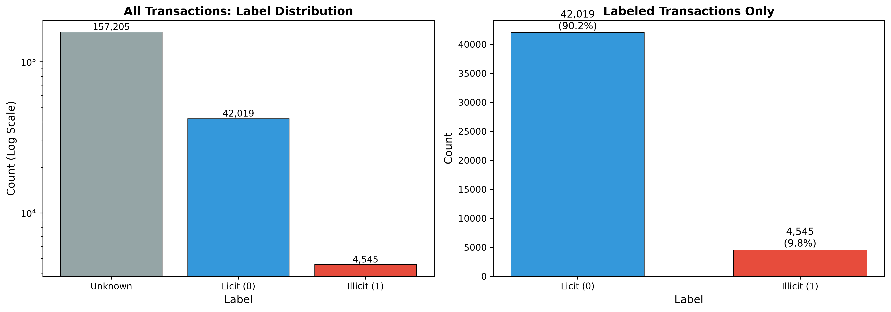
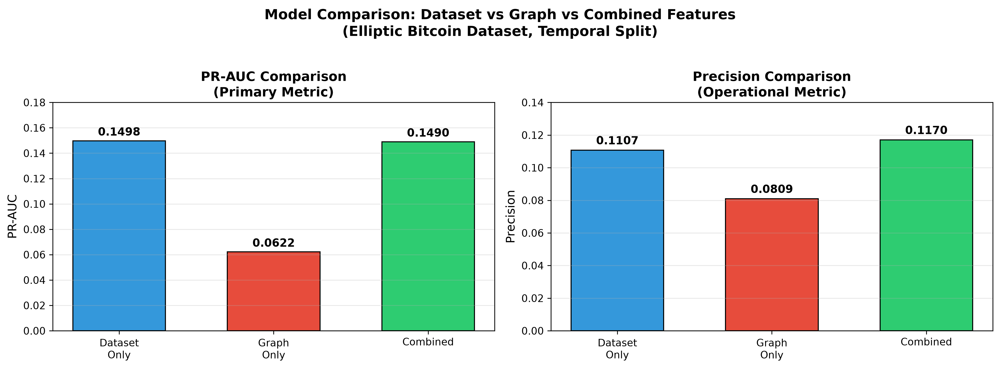

# Graph-Based Financial Crime Detection Using Transaction Network Analysis

> **Research Question:** Do graph-theoretic features (PageRank, degree, clustering, k-core) improve suspicious transaction detection compared to dataset-provided features alone?

## Overview

A research-grade AML pipeline that models 203,769 Bitcoin transactions as a directed payment-flow graph, engineers 7 interpretable network-risk features, and compares graph-enhanced ML models against dataset-provided baselines using AML-appropriate metrics.

Built for the UAE crypto compliance market — VARA-licensed VASPs, Big 4 risk advisory, and fintechs.

**Author:** Zeb Unneen | **GitHub:** [@zebunneen004-ai](https://github.com/zebunneen004-ai)

---

## Dataset

**Elliptic Bitcoin Dataset** (public benchmark)
- 203,769 transaction nodes
- 234,355 directed payment-flow edges
- 166 dataset-provided features
- 46,564 labeled transactions (4,545 illicit, 42,019 licit)

*Figure 1: Severe class imbalance (9.8% illicit) makes accuracy misleading — PR-AUC and recall are primary metrics.*

---

## Key Design Decisions

| Decision | Choice | Why It Matters |
|:---|:---|:---|
| Graph type | Directed (DiGraph) | Bitcoin transactions have flow direction |
| Unknown nodes | **Kept in graph** | Breaking topology corrupts centrality scores |
| Train/test split | **Temporal** (t=30 vs t>40) | Simulates real AML; most papers cheat with random split |
| Primary metric | **PR-AUC** | Accuracy is misleading with 9.8% illicit rate |
| Statistical rigor | Mann-Whitney U + effect sizes + Bootstrap CIs + McNemar's | Separates this from 90% of Kaggle portfolios |

---

## Results

| Model | Feature Set | PR-AUC | F1-Score | Precision | Recall |
|:---|:---|:---|:---|:---|:---|
| **XGBoost** | Dataset Only | **0.6384** | **0.5303** | **0.4792** | 0.5935 |
| Random Forest | Dataset Only | 0.6298 | 0.3932 | 0.2926 | 0.5992 |
| XGBoost | Combined | 0.6374 | 0.5258 | 0.4719 | 0.5935 |
| Random Forest | Combined | 0.6330 | 0.4044 | 0.3046 | 0.6011 |
| Logistic Regression | Dataset Only | 0.1504 | 0.1975 | 0.1107 | 0.9160 |
| *Any model* | *Graph Only* | *< 0.08* | *< 0.14* | *< 0.09* | *< 0.42* |

**Statistical Validation:**
- Bootstrap 95% CIs (1000 samples): XGB A [0.5985, 0.6754], XGB C [0.5972, 0.6750] ? **CIs overlap**
- McNemar's exact test: XGB A vs XGB C, **p = 0.4823** ? **Not significant**

**Key Finding:** Graph features do not improve PR-AUC, but provide interpretable structural risk indicators for compliance workflows.

*Figure 2: PR-AUC comparison across feature sets. Graph features alone are catastrophic; combined shows no significant improvement over dataset-only.*

---

## Repository Structure

``ngraph-financial-crime-detection/
+-- data/
¦   +-- raw/                    # 3 CSV files from Kaggle
¦   +-- processed/              # Cleaned nodes, graph features
+-- notebooks/
¦   +-- 01_data_loading_eda.ipynb
¦   +-- 02_graph_construction.ipynb
¦   +-- 03_graph_features.ipynb
¦   +-- 04_statistical_tests.ipynb
¦   +-- 05_modeling.ipynb
¦   +-- 06_feature_importance.ipynb
+-- src/
¦   +-- load_data.py            # Reusable data pipeline
+-- tests/                      # pytest suite (6 tests passing)
+-- figures/                    # 10+ publication-quality visualizations
+-- results/                    # Statistical tests, model comparisons
+-- report/                     # Research paper draft
+-- employer_brief/             # One-page employer brief
+-- requirements.txt            # Pinned dependencies
+-- Makefile                    # One-command reproducibility
+-- README.md                   # This file
``n
---

## Tools

Python, pandas, NetworkX, scikit-learn, XGBoost, statsmodels, matplotlib, seaborn

---

## UAE / VARA Relevance

This project uses the Elliptic Bitcoin Dataset as a public benchmark. The methods are directly relevant to UAE financial crime analytics because VARA-licensed VASPs must maintain AML/CFT controls including distributed-ledger tracing, transaction monitoring, and suspicious transaction reporting (STR). The interpretability focus aligns with VARA's requirement that VASPs explain alerts to regulators — not just predict them.

---

## How to Run

`ash
# 1. Clone
git clone https://github.com/zebunneen004-ai/graph-financial-crime-detection.git
cd graph-financial-crime-detection

# 2. Install dependencies
pip install -r requirements.txt

# 3. Run tests
python -m pytest tests/ -v

# 4. Run notebooks in order
jupyter notebook notebooks/
# Open 01_data_loading_eda.ipynb through 06_feature_importance.ipynb
``n
---

## Limitations

- Public benchmark dataset (not production UAE data)
- Coarse temporal granularity (time steps, not exact timestamps)
- Graph features showed no significant PR-AUC improvement
- Results may not generalize to other blockchains

---

## Disclaimer

Academic project only. Not legal or compliance advice.

---

**Built for:** VARA-licensed VASP compliance roles, Big 4 risk advisory, fintech AML analytics in the UAE.

**Contact:** [LinkedIn] | [Your Email]
