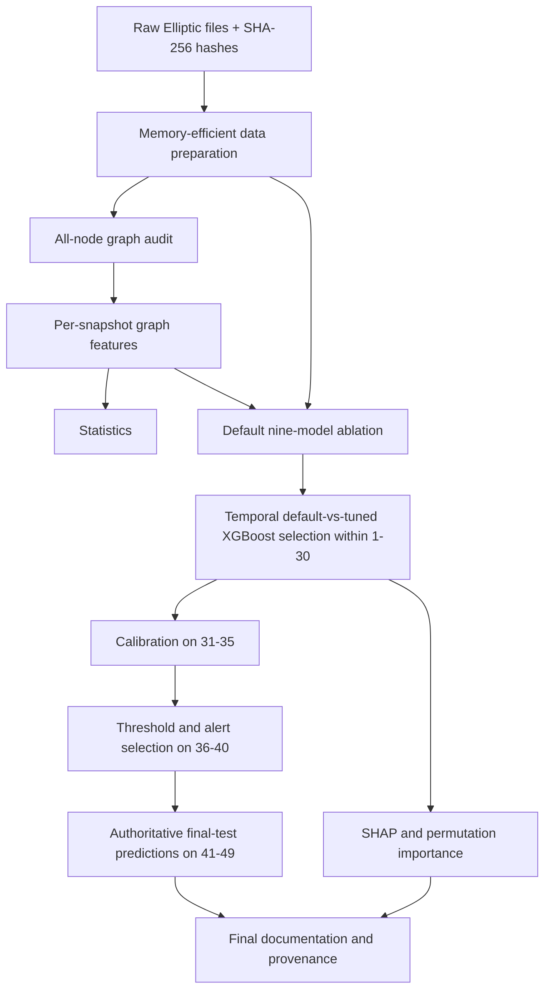

# Transaction Network Analysis for Financial Crime Detection and AML Alert Prioritization

## 30-Second Summary

This reproducible research implementation evaluates whether five additional interpretable node-level topology variables improve illicit-transaction classification beyond the Elliptic benchmark's supplied local and one-hop aggregated attributes. Unknown-labeled transactions are preserved in the graph and excluded from supervised metrics. Model selection, probability calibration, operating-point selection and final evaluation use chronologically separated evidence.

## Key Finding

The operational candidate selected using expanding-window temporal cross-validation within time steps 1–30 was **tuned dataset only**. Its final labeled-holdout PR-AUC was **0.6422**. The best combined-minus-best-dataset-only final-test difference was **+0.0004 PR-AUC**, with a paired bootstrap 95% interval of **[-0.0022, +0.0028]**. A confidence interval containing zero means the paired analysis did not detect a statistically reliable improvement. It does not prove the models are identical or that graph features can never help.

## Dataset

- 203,769 transaction nodes
- 234,355 directed transaction-to-transaction edges
- 4,545 illicit-labeled, 42,019 licit-labeled and 157,205 unknown-labeled transactions
- 165 supplied model predictors: 93 local predictors after excluding `time_step`, plus 72 one-hop aggregated predictors
- 49 time steps
- SHA-256 hashes for all three raw files are recorded in `results/final/data_manifest.json`

Unknown means that no supervised ground-truth label is supplied. Unknown observations are retained for topology calculations and excluded from supervised evaluation.

## Research Question

**Primary:** Do additional interpretable node-level topological features improve illicit-transaction classification beyond the Elliptic dataset's supplied local and one-hop aggregated attributes under chronological evaluation?

**Secondary:** When topology variables do not materially improve predictive performance, do they provide useful descriptive network context for AML review?

## Methodology

Primary added graph variables:

- in-degree
- out-degree
- snapshot-normalized PageRank
- clustering coefficient on an undirected projection
- k-core number on an undirected projection

PageRank is computed independently within each completed time-step snapshot. The primary PageRank feature is divided by the snapshot's uniform baseline, so a value of 1 equals the snapshot mean and global 1/N scaling cannot act as an indirect snapshot-size feature. Raw within-snapshot PageRank is retained only as a descriptive output. `total_degree` is excluded because it is exactly `in_degree + out_degree`. `weak_component_size` is analyzed separately because it behaves as a snapshot-size/time-step proxy rather than transaction-level isolation. In the tuned sensitivity model, adding this snapshot variable changed final-test PR-AUC by **+0.0034** relative to the tuned primary combined model.

## Chronological Evaluation

- Training, temporal tuning and model selection: time steps 1–30
- Probability calibration only: time steps 31–35
- Threshold and alert-budget selection only: time steps 36–40
- Final untouched labeled holdout: time steps 41–49

The final holdout does not influence feature-set choice, default-versus-tuned selection, calibration fitting, threshold selection or alert-budget selection.

## Model Comparison

| Model | Feature set | PR-AUC | Precision | Recall | F1 |
|---|---|---:|---:|---:|---:|
| Logistic Regression | Combined | 0.1539 | 0.235 | 0.416 | 0.300 |
| Logistic Regression | Dataset Only | 0.1492 | 0.218 | 0.431 | 0.289 |
| Logistic Regression | Graph Only | 0.0663 | 0.088 | 0.294 | 0.135 |
| Random Forest | Combined | 0.6408 | 0.960 | 0.553 | 0.702 |
| Random Forest | Dataset Only | 0.6388 | 0.944 | 0.550 | 0.695 |
| Random Forest | Graph Only | 0.0628 | 0.067 | 0.777 | 0.123 |
| Xgboost | Combined | 0.6418 | 0.934 | 0.565 | 0.704 |
| Xgboost | Dataset Only | 0.6474 | 0.928 | 0.567 | 0.704 |
| Xgboost | Graph Only | 0.0613 | 0.066 | 0.290 | 0.108 |

Threshold-dependent metrics use thresholds selected on the operating-selection block. Accuracy is not used as the lead metric.

## Operational Candidate Selection

For dataset-only and combined XGBoost, the default and tuned variants are compared using the same expanding-window temporal folds. Tuning is accepted only when it improves mean temporal-CV PR-AUC by at least the configured minimum gain. The combined feature set is selected only when its best candidate exceeds the best dataset-only candidate by the configured practical PR-AUC margin. This prevents a tuned model from being selected merely because tuning was attempted.

## Incremental Graph-Feature Results

The direct incremental comparison uses aligned final-test predictions from the best temporally selected dataset-only and combined candidates. Paired observation-level bootstrap and time-step block-bootstrap intervals are reported. An interval containing zero is interpreted as failure to detect a statistically reliable improvement, not proof of model identity or universal uselessness of graph variables.

## Calibration

Raw XGBoost outputs are treated as model scores. A sigmoid calibrator was fitted only on labeled time steps 31–35. Final-test Brier score changed from **0.03472** before calibration to **0.02851** after calibration. Calibration and ranking discrimination are reported separately.

## Alert-Prioritization Analysis

Among the predefined 1%, 5%, 10% and 20% budgets, **5%** was selected on time steps 36–40 using the documented F1 rule and applied unchanged to the final labeled holdout.

- Alerts: 499 of 9,973
- Precision: 62.5%
- Recall: 59.5%
- F1: 0.610
- False positives per true positive: 0.60
- Lift over labeled prevalence: 11.90×

This is an experiment-specific operating point, not a universally optimal AML alert budget.

## Explainability

TreeSHAP outputs are generated from the authoritative operational candidate in raw model-output space. SHAP explains the fitted model's output decomposition; it does not establish criminal intent or independently justify an STR. Permutation importance is generated from the best combined candidate selected by temporal CV and reports uncertainty across repeated permutations.

## Network Context

The processed graph contains 49 weak components and every checked edge remains within its time step. The graph is a directed acyclic graph with no self-loops. These are properties of the processed Elliptic benchmark. Observed sources and sinks are defined only within the supplied subgraph and are not automatically mining transactions, cold storage or final endpoints.

## Limitations

- Public benchmark; not UAE-specific production data
- Anonymous supplied features
- Incomplete and potentially non-random label availability
- Unknown transactions cannot be evaluated with supervised metrics
- Completed-snapshot graph variables; batch rather than live evaluation
- Coarse time steps and only one blockchain dataset
- Dependence among connected observations
- Five simple topology variables rather than a complete network representation
- Hyperparameter search and candidate comparison reuse the same temporal folds within the training era, so CV estimates for the selected tuned candidate may be optimistic
- Benchmark prevalence does not represent real VASP prevalence
- Results may not generalize to production VASP populations

## UAE and AML Relevance

This public benchmark demonstrates analytical methods relevant to VASP financial-crime analytics, including chronological evaluation, network context, explainability, calibration, alert prioritization, workload analysis and output provenance. It does not establish regulatory compliance and does not replace investigator or MLRO judgment.

## Future Work

Future work should examine causally available transaction-time features, nested temporal model selection, additional blockchain datasets, entity or wallet-level graphs, graph embeddings, time-aware network models, label-selection bias and institution-specific alert-utility functions.

## Reproducibility

This final run used Python **3.14.6**. Create an isolated environment using an available compatible Python installation:

```bat
py -m venv .venv
.venv\Scripts\activate
python -m pip install -r requirements.txt
run.bat
```

Cross-platform execution:

```bash
python src/corrected_master_pipeline.py --config config/config.yaml --overwrite
```

All authoritative outputs are written under `results/final`, `figures/final` and `models/final`. `results/final/provenance_manifest.csv` records output lineage and the Git commit when the repository was committed before execution.

## Repository Structure



## Disclaimer

This repository is a reproducible research implementation. It is not a production AML platform, not real-time transaction monitoring, not legal advice and not evidence that any transaction or person committed a crime.
